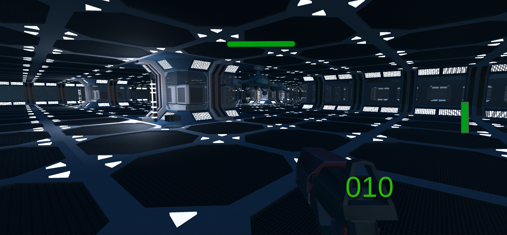

# Space Shooter

## Project description
Space Platform Survival is a fast-paced action game set on a platform in outer space, where players face off against three types of enemies. The goal is to survive in challenging conditions and defeat enemies. Better weapon and ammopacks can be found on the map. 
The game was created by two students as part of a university project.

## Key features
- Three Enemy Types:
  - Robots: Intelligent enemies with NavMesh that follow the player and shoot from a distance.
  - Homing Drones: These can navigate around obstacles while chasing the player.
  - Speed Drones: They fly directly at the player and can crash into obstacles along the way.
- Power-Ups: Ammo packs and weapon upgrades are scattered across the platform, helping the player survive longer and fight more effectively.

## Tools
- Unity 2022.3.12f1
- C#
- NavMesh

## Screenshots
 
 

## Assets
W projekcie wykorzystano następujące zewnętrzne zasoby:

- **Sci-Fi Styled Modular Pack** – downloaded from [Unity Asset Store](https://assetstore.unity.com/packages/3d/environments/sci-fi/sci-fi-styled-modular-pack-82913).
- **Asteroids Pack** – downloaded from [Unity Asset Store](https://assetstore.unity.com/packages/3d/environments/asteroids-pack-84988).
- **Classic Space Skybox** – downloaded from [Unity Asset Store](https://assetstore.unity.com/packages/2d/textures-materials/classic-space-skybox-11596).
- **Galactic Heroes Cartoon Spaceship** – downloaded from [Unity Asset Store](https://assetstore.unity.com/packages/3d/galactic-heroes-cartoon-spaceship-70188)).
- **Free 2D Impact FX** – downloaded from [Unity Asset Store](https://assetstore.unity.com/packages/vfx/particles/fire-explosions/free-2d-impact-fx-201222).
- **Robot Hero : PBR HP Polyart** – downloaded from [Unity Asset Store](https://assetstore.unity.com/packages/3d/characters/robots/robot-hero-pbr-hp-polyart-106154).

## License
The project is available under the MIT License.
